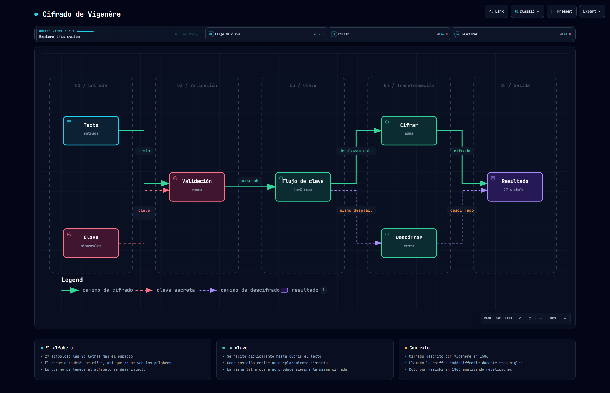

# Encryptator

Implementación desde cero del **cifrado de Vigenère**, con una interfaz para cifrar y descifrar
texto. Todo ocurre en el navegador: no hay servidor, ni petición de red, ni nada que salga del
equipo.

React 19 · Vite 7 · sin más dependencias que React



> Diagrama generado con [Archify](https://github.com/tt-a1i/archify) a partir del código de este
> repositorio. Especificación en [`docs/algoritmo.dataflow.json`](docs/algoritmo.dataflow.json);
> versión navegable en [`docs/algoritmo.html`](docs/algoritmo.html).

---

## Cómo funciona

El cifrado César desplaza todas las letras la misma cantidad, y por eso se rompe probando 26
posibilidades. Vigenère resuelve eso usando **una clave que cambia el desplazamiento en cada
posición**.

La clave se repite cíclicamente hasta cubrir el texto:

```
texto  →  h o l a   m u n d o
clave  →  k e y k e y k e y k
```

Y cada símbolo avanza tantas posiciones como indique la letra de clave que le toca. La consecuencia
importante es que **la misma letra clara no produce siempre la misma letra cifrada**: la primera
`o` de «hola» y la segunda de «mundo» salen distintas. Eso es lo que anula el análisis de
frecuencias, que es la forma habitual de romper un cifrado por sustitución.

### El alfabeto tiene 27 símbolos

```js
const ALPHABET = 'abcdefghijklmnopqrstuvwxyz ';
```

El espacio está dentro a propósito. En la versión clásica de Vigenère los espacios se dejan tal
cual, y eso enseña dónde empieza y acaba cada palabra — que es media pista regalada. Aquí el
espacio se cifra como un símbolo más, así que el resultado no revela la longitud de las palabras.

### El flujo de clave

```js
const generateKeyStream = (text, key) => {
  let keyStream = '';
  let keyIndex = 0;
  for (let i = 0; i < text.length; i++) {
    if (ALPHABET.includes(text[i])) {
      keyStream += key[keyIndex % key.length];
      keyIndex++;
    } else {
      keyStream += ' ';
    }
  }
  return keyStream;
};
```

El detalle está en el `keyIndex` separado del índice del bucle: la clave **solo avanza cuando el
carácter pertenece al alfabeto**. Si el texto trae algo que no se cifra, ese carácter se copia
igual y no consume una letra de clave, de modo que el descifrado vuelve a alinearse solo.

### Cifrar y descifrar

Son la misma operación en sentidos opuestos, en módulo 27:

```js
const newIndex = (textIndex + keyIndex) % ALPHABET.length;   // cifrar
```

```js
let newIndex = (textIndex - keyIndex);            // descifrar
if (newIndex < 0) {
  newIndex += ALPHABET.length;
}
```

La corrección del negativo hace falta porque el `%` de JavaScript conserva el signo del dividendo:
`-3 % 27` da `-3`, no `24`.

## Contexto histórico

Blaise de Vigenère lo describió en 1586. Durante casi tres siglos se le llamó *le chiffre
indéchiffrable*, hasta que **Friedrich Kasiski publicó en 1863** el método que lo rompe: buscar
secuencias repetidas en el texto cifrado, medir las distancias entre ellas y deducir de sus
divisores comunes la longitud de la clave. Sabiendo esa longitud, el texto se parte en tantos
cifrados César como letras tenga la clave, y cada uno cae por frecuencias.

Es un cifrado histórico y así hay que entenderlo: la criptografía moderna usa AES o ChaCha20, y en
el navegador se accede a ellos por la Web Crypto API. Este proyecto está hecho para entender cómo
funciona una clave que se repite, no para guardar secretos.

## Estructura

```
src/
├── App.jsx                      estado y orquestación
├── utils/encryption.js          el algoritmo completo
└── components/
    ├── Header.jsx
    ├── InputSection.jsx         texto, clave y validación
    ├── OutputSection.jsx        resultado y copiado
    └── Footer.jsx
```

## Puesta en marcha

```bash
npm install
npm run dev
```

La clave admite solo letras minúsculas sin espacios ni acentos, y el texto a cifrar solo letras
minúsculas y espacios. Ambas restricciones se comprueban antes de operar.
